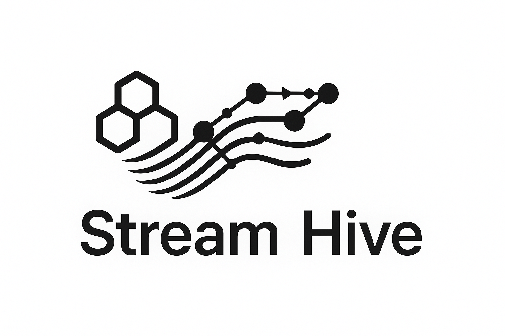

# Stream Hive

> Combining Multiple Streaming Queries to provide actionable insights. 


<p align="center">
  
</p>

## Linting

You run the linter via 
```shell
npm run lint:ts
```

You can automatically fix some issues via
```shell
npm run lint:ts:fix
```

## License

This code is copyrighted by [Ghent University - imec](https://www.ugent.be/ea/idlab/en) and released under the [MIT Licence](./LICENCE) 

## Contact

For any questions, please contact [Kush](mailto:kushbisen@proton.me) or create an issue in the repository [here](https://github.com/SolidLabResearch/stream-hive/issues). 
