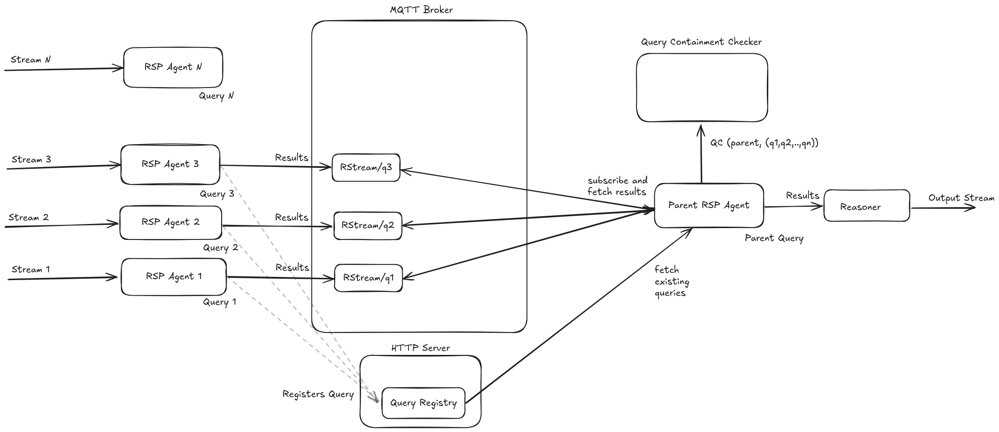

# Streaming Query Hive

> Combining Multiple Streaming Queries to provide actionable insights. 

## Linting

You run the linter via 
```shell
npm run lint:ts
```

You can automatically fix some issues via
```shell
npm run lint:ts:fix
```

## Example Architecture

The Streaming Query Hive can handle multiple streaming queries from different sources, and utilizes different streaming operators to process the data. The architecture is designed to be modular, allowing for easy integration of new sources and operators. An example architecture combining three different sources and the results from the RDF Stream Processing Agents to solve for a specific Parent Query is shown below:




In the architecuture, it is assumed that the query results from the RSSP Agents is being streamed to a MQTT topic. The MQTT topic is then consumed by the Streaming Query Hive, which processes the aggregated results using different streaming operators to solve for the Parent Query. The relationship between the queries to esatablish that the Child Queries are part of the Parent Query is established using the Query Containment [1](#footnote-1) Relationship. 

The Streaming Queries utilized in the architecture are described in the RSP-QL query language [[2](#footnote-2)]. The tool utilized to find if the queries have the Query Containment [[1](#footnote-1)] or the Query Isomorphism [[3](#footnote-3)] is the RSP-QL Containment Checker [[4](#footnote-4)]. The RSP-QL Containment Checker is a tool that checks if a query is contained in another query, and can be used to determine if the results of one query can be used to solve another query. The tool is designed to work with the RSP-QL query language, and builds on the work done by the SPeCS Solver [[5](#footnote-5)] to support aggregation functions and the streaming semantics of the RSP-QL query language.

The MQTT broker can be easily changed with another broker, such as RabbitMQ or Kafka, in the future. 

## License

This code is copyrighted by [Ghent University - imec](https://www.ugent.be/ea/idlab/en) and released under the [MIT Licence](./LICENCE) 

## Contact

For any questions, please contact [Kush](mailto:kushbisen@proton.me) or create an issue in the repository [here](https://github.com/SolidLabResearch/streaming-query-hive/issues). 

### Footnotes

[1]: <a href="https://link.springer.com/referenceworkentry/10.1007/978-0-387-39940-9_1269"> Query Containment </a>

[2]: <a href="https://www.igi-global.com/article/rsp-ql-semantics/129761">RSP-QL Semantics: A Unifying Query Model to Explain Heterogeneity of RDF Stream Processing Systems </a>

[3]: <a href="https://link.springer.com/content/pdf/10.1007/3-540-48005-6_3.pdf"> Matching RDF Graphs </a>

[4]: <a href="https://github.com/SolidLabResearch/rspql-containment-checker"> RSP-QL Containment Checker </a>

[5]: <a href="https://github.com/mirkospasic/SpeCS"> SPeCS Solver </a>